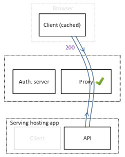
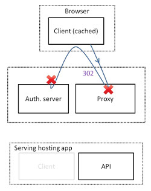
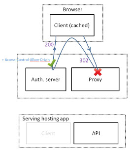

# Dealing with third-party proxy

If you've ever developed web applications for a large company, you must be familiar with having authentication done by a third-party proxy. And by third-party I mean handled by another team.

In my case, this is what our architecture looks like:



## So, how's that a problem ?

It's not necessarily a problem! But sometimes the proxy's behavior isn't what you would have expected. Like when your session expires, you might expect a 401 from this proxy and get a 302 instead.

Even if you can communicate with the authentication team, having to require their help takes time and introduces delays, so generally you try to make do with what you have!

In our case, we were having problems with API calls from our application :

```
XMLHttpRequest cannot load https://auth-server.com?sourceUrl=https%3A%2F%2Fmy-app.com%2Fapi%2Fexample. No 'Access-Control-Allow-Origin' header is present on the requested resource. Origin https://my-app.com/api/example is therefore not allowed.
```
is the chrome console error we kept having. After looking it up, this is what you get when trying to make a cross-domain ajax call.


#### What does cross-domain mean ?

Wikipedia says:
> Cross-origin resource sharing (CORS) is a mechanism that allows resources (e.g. fonts, JavaScript, etc.) on a web page to be requested from another domain outside the domain from which the resource originated.

By default, you are not allowed to request a resource from another domain via an ajax call. Why is that? To prevent security issues such as cross-site scripting (XSS) attacks.

This is why none of our API calls actually went through.



What's in fact happening is, since our application is cached (via a cache manifest), when trying to use it while our authentication session has expired, we only fire ajax API calls to [https://my-app.com/api/example](#). Unfortunately those calls are blocked and you thus never get redirected in your browser to the login page.  

So in the end trying to use your app does nothing: you are not redirected to the authentication server login.


#### How to allow cross-domain calls

Calling an asset via an ajax call is possible only if the domain which hosts that asset allows it. You enable it by adding a header. So this means in our case :
`Access-Control-Allow-Origin: https://my-app.com`

For the record, this header comes along with 3 others, which help you narrow down the rule to your specific need :

```
Access-Control-Allow-Methods: POST, GET, HEAD, OPTIONS
Access-Control-Allow-Headers: X-PINGOTHER
Access-Control-Max-Age: 1728000
```

#### Intercepting a 302 with Angular

That's great! Now all we have to do is convince the authentication team to add the right header and we'll be able to intercept their 302 response whenever we fire a API call while unauthenticated.. right? But wait a minute, is it even possible to intercept a 302 using - say -  Angular? Well, let's see. Here's how you would go about it :

```
angular.module('http-auth-interceptor', ['http-auth-interceptor-buffer'])
.factory('httpMovedInterceptor', function($window, $location){
  return {
    response: function(rejection) {
			var loginPage = 'https://auth-server.com/login'
      if (rejection.status == 302 && rejection.config.url.split('?')[0] == loginPage) {
        return $window.location.href = loginPage + '?sourceUrl=' + encodeURIComponent($location.absUrl())
      }
    }
  };
})
.config(['$httpProvider', function($httpProvider) {
  $httpProvider.interceptors.push('httpMovedInterceptor');
}])
```

First we create a factory to intercept responses, then we register it with the $httpProvider.

That's good and all, but it would'nt work.. The 302 http code is dealt with at a browser level - as shown on below figure, meaning that your app cannot intercept the 302 in time and instead gets the 200 from the login page.




## Solution

#### Ideal

Let's stay pragmatic here! Probably the easiest and most efficient solution is to ask the authentication team to change the proxy's response from 302 to 401. This way, you can easily detect when your API calls fail and 'manually' redirect your browser to your authentication login page.

However, the authentication team may not be able to comply with that need. For instance, if they have other teams excepting a 302 and cannot work on a case-by-case basis.


#### Workaround

If you have to stick with the 302s, what you're left with is analyzing the API call responses and whenever you get a 200 code and page url that corresponds to your page login, you manually force your browser to load that page with :

`$window.location.href = <you login page url>`


## Conclusion

Proxies which send you 302s on authentication can be a nightmare to deal with when developing API based applications. Do ask for 401s instead in response to any unauthenticated API calls. If that's not achievable, you'll have to expect your login page as a response to your ajax call and manually redirect to the login page in your browser.
